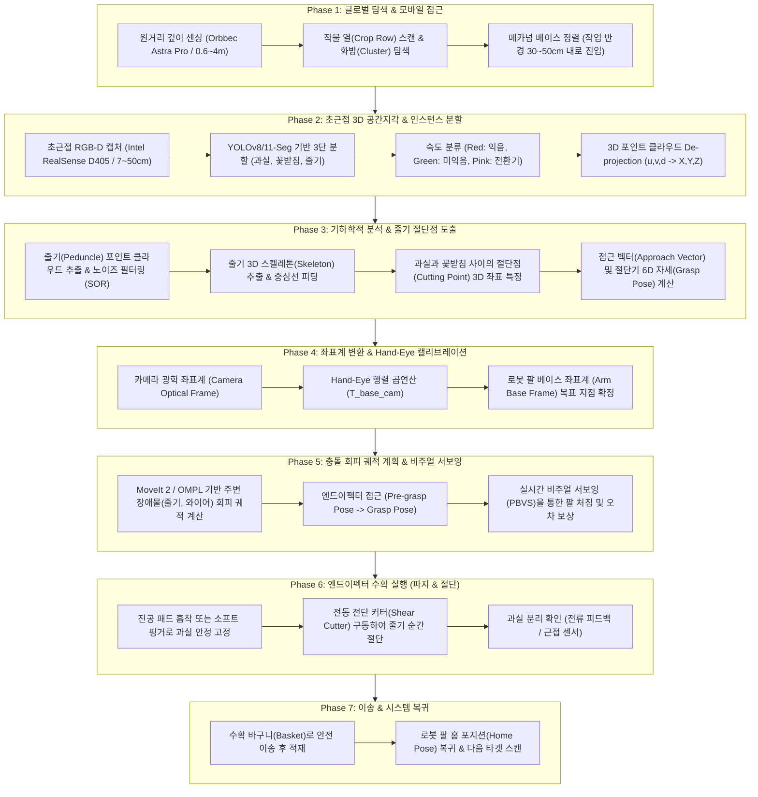

# 토마토 수확 로봇 아키텍처 및 6단계 마스터 로드맵
> **Autonomous Robotic Tomato Harvesting: System Architecture, Spatial Perception & Learning Roadmap**

---

## 1. 개요 (Overview)

토마토 자동 수확(Robotic Tomato Harvesting)은 농업 로보틱스(Agricultural Robotics) 분야에서 가장 기술적 난이도가 높은 과제 중 하나입니다. 산업용 픽 앤 플레이스(Pick-and-place)와 달리, 온실 및 노지 환경의 과채류 수확은 **완벽한 비정형(Unstructured), 고밀도 가려짐(Heavy Occlusion), 복잡한 조명 변화(Varying Illumination)**를 극복해야 합니다.

특히 토마토는 사과나 배와 달리 다음과 같은 고유한 생물학적/물리적 특성을 가집니다:
1. **과실 손상 취약성**: 과실 표면이 부드러워 파지력이 과도할 경우 즉각적인 상품성 훼손(상처, 멍, 과즙 누출)이 발생합니다.
2. **이탈 방식(Abscission Layer)**: 토마토는 단순히 과실을 당겨서 따면 줄기나 꽃받침이 찢어지거나 열매가 뭉개집니다. 따라서 **꼭지(Peduncle) 위의 탈리층(Abscission Zone)을 꺾거나, 가위/커터로 줄기를 직접 절단**하는 방식이 필수적입니다.
3. **군집 결실(Cluster/Truss structure)**: 토마토는 보통 화방(Truss) 단위로 4~8개가 뭉쳐 자라므로, 익은 토마토 주변에 덜 익은 초록 토마토, 잎, 줄기, 지지용 와이어(Trellis wire)가 뒤엉켜 있습니다.

따라서 성공적인 토마토 수확을 위해서는 **"2D 색상 검출"** 수준을 넘어, **"정밀 3D 공간지각(Spatial Perception) → 줄기 6D 자세 추정(6-DoF Pose) → 무충돌 궤적 생성(Collision-Free Motion Planning) → 복합 엔드이펙터 절단/파지(Dual-Action Gripping & Cutting)"**로 이어지는 유기적인 전주기 파이프라인이 요구됩니다.

---

## 2. 전주기 7단계 수확 파이프라인 (End-to-End Pipeline)



---

## 3. 공간지각을 위한 핵심 하드웨어 & 센서 레이어

| 센서 / 모듈 | 주 사용처 | 유효 동작 거리 | 핵심 기술적 역할 및 주의점 |
|---|---|---|---|
| **Intel RealSense D405** | 초근접 손목/손끝 비전 (Eye-in-Hand 또는 고정) | **7 ~ 50 cm** (초근거리) | **0.1mm급 고정밀 능동 IR 스테레오**.<br/>RGB 센서와 깊이 센서가 단일 ISP로 통합되어 픽셀-깊이 불일치(Misalignment)가 거의 없음. 토마토 꽃받침/줄기 인식의 핵심. |
| **Orbbec Astra Pro** | 원거리 환경/작물 탐색 (Eye-to-Hand) | **60 ~ 400 cm** (원거리) | **IR 구조광(Structured Light)**.<br/>로봇 베이스가 작물 열에 다가갈 때 화방 전체의 대략적인 위치를 스캔. 60cm 이하에서는 맹점(Blind zone) 발생. |
| **SO-101 / 5~6축 매니퓰레이터** | 관절 구동 및 3D 이동 | 최대 작업반경 ~35 cm | Feetech 버스 서보 기반 경량 팔.<br/>**자유도 한계(5-DoF)**: 제자리 순수 Yaw 회전 불가(집게가 바닥을 향할 때만 Roll=Yaw 가능). 기구학적 특이점 회피 알고리즘 필수. |
| **메카넘 휠 베이스** | 전방향 지상 이동 | 실내 평탄면 (온실 레일/바닥) | X축(전진), Y축(게걸음), W축(회전) 독립 제어.<br/>팔의 좁은 작업반경(Workspace)을 보완하기 위해 베이스 이동을 통한 굵은 정렬(Coarse Alignment) 수행. |
| **NVIDIA Jetson Orin Nano** | 온디바이스 엣지 AI & ROS 2 연산 | 로봇 차체 내장 | GPU 가속(TensorRT) 기반 실시간 YOLOv8 인스턴스 세그멘테이션(30+ FPS) 및 PointCloud 필터링, ROS 2 노드 통신 총괄. |

---

## 4. 학습 모듈 체계 (Curriculum Structure)

사용자가 개념부터 실전 코드까지 단계별로 완벽히 습득할 수 있도록 5개 전문 모듈 문서와 브라우저 학습 포털로 구성됩니다:

```
docs/study/
├── index.html                      # [통합 학습 포털 SPA] 인터랙티브 다이어그램, 24편 논문/12개 오픈소스 검색 뷰어
├── 00_OVERVIEW_ROADMAP.md          # [현재 문서] 전체 수확 파이프라인, 하드웨어 사양, 학습 로드맵
├── 01_SPATIAL_PERCEPTION.md        # 3D 비전 공간지각, RGB-D 투영 수학, 점군 필터링, Hand-Eye 캘리브레이션
├── 02_PAPERS_CATALOG.md            # 24편 핵심 논문 완전 해설집 (연구배경, 수학공식, 실험결과, 토마토 적용점)
├── 03_OPENSOURCE_GUIDE.md          # 12개 오픈소스 심층 분석, 빌드/설치법, Jetson & ROS 2 연동 코드
├── 04_END_EFFECTOR_MANIPULATION.md # 6-DoF Grasp Pose 산출, 줄기 스켈레톤 추출, MoveIt 2 충돌회피, 커터 설계
└── 05_PRACTICE_JETSON_ROS2.md      # 실제 장비(D405 + Astra + SO-101 + Jetson) 기반 실전 엔지니어링 튜토리얼
```

---

## 5. 단계별 학습 마일스톤 (Study Milestones)

| 단계 | 목표 학습 내용 | 달성 역량 | 관련 문서 |
|---|---|---|---|
| **Step 1** | 공간지각의 기초 기하학 및 센서 원리 | 핀홀 카메라 모델, 왜곡 보정, 깊이 맵 De-projection, Hand-Eye 변환 수학 이해 | `01_SPATIAL_PERCEPTION.md` |
| **Step 2** | 글로벌 SOTA 논문 심층 독해 | 24편의 논문(과실 인식, 3D 점군, 줄기 절단, 엔드이펙터, 필드 시스템) 핵심 아이디어 흡수 | `02_PAPERS_CATALOG.md` |
| **Step 3** | 핵심 오픈소스 도구 체인 마스터 | YOLOv8-seg, Open3D, MoveIt 2, easy_handeye, LeRobot, AnyGrasp 빌드 및 파이프라인 결합 | `03_OPENSOURCE_GUIDE.md` |
| **Step 4** | 줄기 절단점 도출 및 파지 기구학 설계 | 스켈레톤 세선화(Thinning), 접근 벡터 계산, 5-DoF/6-DoF 역기구학 풀이, 충돌 회피 구현 | `04_END_EFFECTOR_MANIPULATION.md` |
| **Step 5** | 실장비 통합 및 엔드투엔드 수확 구현 | RealSense D405 + ROS 2 Humble + Jetson Orin Nano 상에서 원클릭 수확 노드 완성 | `05_PRACTICE_JETSON_ROS2.md` |

다음 문서인 [`01_SPATIAL_PERCEPTION.md`](01_SPATIAL_PERCEPTION.md)에서 공간지각의 핵심 수학 공식과 포인트 클라우드 처리 파이프라인을 다룹니다.

