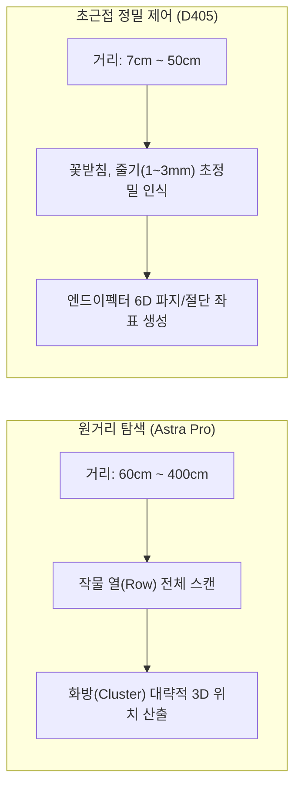
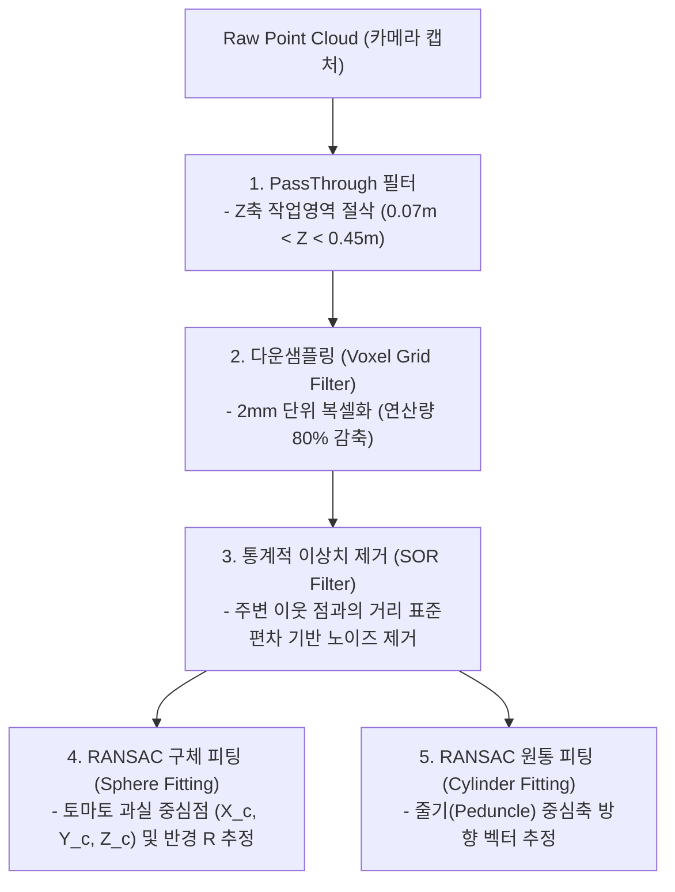
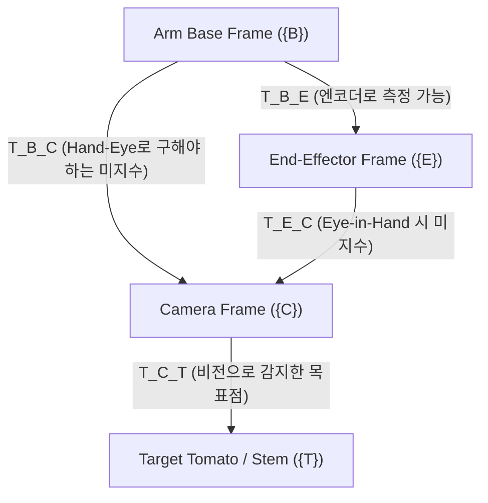

# 공간지각(Spatial Perception) 및 3D 비전 기하학 마스터 가이드
> **Spatial Perception, 3D Point Cloud Processing, and Hand-Eye Calibration for Robotic Harvesting**

---

## 1. 3D 공간지각의 핵심 수학적 원리 (Camera Geometry)

카메라가 찍은 2차원 화소 평면$(u, v)$과 깊이 값 $d$를 로봇이 실제로 이동할 수 있는 물리적인 3차원 공간 좌표 $(X_c, Y_c, Z_c)$로 변환하는 기하학적 원리를 다룹니다.

```
       광학 중심 (Optical Center)
              C (0,0,0)
             /    |    \
            /     |     \
           /      |      \
          /       |       \
      ---[------(u,v)------]---  화상 평면 (Image Plane, z = f)
        /         |         \
       /          |          \
      /           |           \
     P_w (X, Y, Z)             물리적 타겟 (토마토 또는 줄기)
```

### 1.1 핀홀 카메라 모델 (Pinhole Camera Model) 및 내부 파라미터 (Intrinsics)
3차원 카메라 좌표계의 점 $P_c = [X_c, Y_c, Z_c]^T$는 정규화 화상 좌표계 $[x, y, 1]^T = [X_c/Z_c, Y_c/Z_c, 1]^T$를 거쳐 픽셀 좌표 $[u, v, 1]^T$로 투영됩니다:

$$
\begin{bmatrix} u \\ v \\ 1 \end{bmatrix} = \frac{1}{Z_c} K \begin{bmatrix} X_c \\ Y_c \\ Z_c \end{bmatrix} = \frac{1}{Z_c} \begin{bmatrix} f_x & 0 & c_x \\ 0 & f_y & c_y \\ 0 & 0 & 1 \end{bmatrix} \begin{bmatrix} X_c \\ Y_c \\ Z_c \end{bmatrix}
$$

* $f_x, f_y$: 초점 거리(Focal length in pixels).
* $c_x, c_y$: 주점(Principal point, 렌즈 광축과 센서가 만나는 중심점 화소 좌표).
* $K$: 카메라 내부 파라미터 행렬(Intrinsic Matrix).

### 1.2 역투영 (2D De-projection $\to$ 3D Point)
깊이 센서로부터 픽셀 $(u, v)$에서의 깊이 거리 $Z_c = d$ (단위: 미터 또는 밀리미터)를 알고 있을 때, 3차원 카메라 좌표 $[X_c, Y_c, Z_c]^T$는 다음과 같이 닫힌 형식(Closed-form)으로 정확히 복원됩니다:

$$
X_c = \frac{(u - c_x) \cdot Z_c}{f_x}, \quad Y_c = \frac{(v - c_y) \cdot Z_c}{f_y}, \quad Z_c = d
$$

> **[주의] 렌즈 왜곡(Lens Distortion)**:
> 초광각 렌즈나 왜곡이 큰 카메라의 경우 브라운-콘라디(Brown-Conrady) 왜곡 계수 $(k_1, k_2, p_1, p_2, k_3)$를 적용하여 먼저 화소 좌표 $(u, v)$를 왜곡 보정(Undistortion)한 후 위 공식을 적용해야 합니다. RealSense D405의 경우 내장 ASIC/SDK가 왜곡 보정된 깊이-컬러 정렬 맵을 제공합니다.

---

## 2. 깊이 카메라 센싱 원리 및 특성 비교 (D405 vs Astra Pro)

토마토 수확 시스템에서 단일 깊이 카메라로는 원거리 탐색과 초근접 절단을 동시에 만족시킬 수 없습니다.



| 비교 항목 | **Intel RealSense D405** (근거리용) | **Orbbec Astra Pro** (원거리용) |
|---|---|---|
| **측정 방식** | 능동 IR 스테레오 (Active IR Stereo) | 구조광 패턴 투영 (Structured Light) |
| **최적 유효 거리** | **7 cm ~ 50 cm** (초근접) | **60 cm ~ 400 cm** (원거리) |
| **깊이 단위(Scale)** | **0.1 mm** (0.0001 m) | **1.0 mm** (0.001 m) |
| **RGB-Depth 정렬** | 단일 ISP 하드웨어 정렬 (완벽 일치) | RGB와 Depth가 물리적으로 분리된 센서 (소프트웨어 정렬 필요) |
| **태양광 취약성** | 비교적 강함 (태양광 하에서도 스테레오 매칭 가능) | 취약 (외부 태양광 IR 성분에 의해 투영 패턴이 묻힘) |
| **수확 시의 역할** | **집게가 열매와 줄기를 물고 자르는 순간의 정밀 유도** | **로봇 베이스가 작물 줄기에 접근하는 경로 탐색** |

> **[핵심 함정] Astra Pro 60cm 맹점과 D405 1m 오차**:
> - Astra Pro는 센서 전방 60cm 이내로 물체가 들어오면 깊이 값이 0(NaN)으로 포화되며, 심한 경우 LDP(레이저 보호장치)가 투광기를 강제로 꺼버립니다.
> - D405는 1m를 넘어가면 스테레오 기저선(Baseline ~18mm)의 한계로 인해 Z축 오차가 수 센티미터 단위로 급격히 증가합니다.
> - 따라서 **원거리 주행은 Astra Pro, 최종 진입 및 피킹은 D405**로 핸드오버(Handover)하는 아키텍처가 필수적입니다.

---

## 3. 포인트 클라우드(Point Cloud) 전처리 및 지하학적 피팅 파이프라인

RGB-D 센서로부터 추출된 3D 점군은 온실 환경의 잎, 줄기, 노이즈, 센서 아티팩트가 심하게 섞여 있습니다. 다음 5단계 전처리 파이프라인을 거칩니다:



### 3.1 통계적 이상치 제거 (SOR: Statistical Outlier Removal)
각 점 $p_i$에 대해 최근접 $k$개 이웃 점들과의 평균 거리 $d_i$를 구하고, 전체 점군의 평균 $\mu$와 표준편차 $\sigma$를 계산합니다:

$$
d_i = \frac{1}{k} \sum_{j=1}^k \| p_i - p_{i,j} \|
$$

거리 $d_i$가 임계값 $\mu + \alpha \cdot \sigma$를 초과하는 점은 센서 노이즈(먼지, 난반사, 비산 픽셀)로 판정하여 제거합니다 ($\alpha$는 보통 1.0 ~ 2.0).

### 3.2 토마토 과실: RANSAC 구체 피팅 (Sphere Model)
토마토 과실 표면 점군 $S = \{(x_i, y_i, z_i)\}$에 대해 구의 방정식:

$$
(x - x_0)^2 + (y - y_0)^2 + (z - z_0)^2 = R^2
$$

RANSAC 반복을 통해 인라이어(Inlier) 개수를 최대화하는 구의 중심 $(x_0, y_0, z_0)$과 반경 $R$을 찾습니다. 이 구의 중심이 과실의 질량 중심(Centroid)이 됩니다.

### 3.3 줄기(Peduncle): RANSAC 원통 피팅 (Cylinder Model)
줄기는 반경 $r$과 축 방향 단위 벡터 $\mathbf{a} = [a_x, a_y, a_z]^T$, 축 상의 한 점 $\mathbf{p}_0$으로 정의됩니다:

$$
\| (\mathbf{p}_i - \mathbf{p}_0) \times \mathbf{a} \| = r
$$

이 원통 모델의 축 방향 벡터 $\mathbf{a}$는 **엔드이펙터 커터가 줄기에 수직으로 진입(Approach Vector)해야 하는 법선 방향**을 결정합니다.

---

## 4. Hand-Eye 캘리브레이션 및 좌표계 변환 수학

로봇 팔이 카메라가 본 3차원 점을 잡으려면, **카메라 좌표계(Camera Frame) $\to$ 로봇 팔 베이스 좌표계(Arm Base Frame)**로의 동차 변환 행렬(Homogeneous Transformation Matrix)을 알아야 합니다.



### 4.1 Eye-to-Hand (카메라 고정) vs Eye-in-Hand (팔에 장착)

1. **Eye-to-Hand (카메라가 베이스나 삼각대에 고정)**:
   - 목표점의 로봇 좌표:
     $$
     ^{base}\mathbf{P}_{target} = {^{base}T_{camera}} \cdot {^{camera}\mathbf{P}_{target}}
     $$
   - 변환식:
     $$
     \begin{bmatrix} X_{base} \\ Y_{base} \\ Z_{base} \\ 1 \end{bmatrix} = \begin{bmatrix} R & \mathbf{t} \\ \mathbf{0}^T & 1 \end{bmatrix} \begin{bmatrix} X_{cam} \\ Y_{cam} \\ Z_{cam} \\ 1 \end{bmatrix}
     $$
   - 특징: 카메라가 흔들리지 않고 넓은 시야를 확보할 수 있으나, 로봇 팔 자체가 카메라 시야를 가리는 오클루전(Self-occlusion)이 발생할 수 있습니다.

2. **Eye-in-Hand (카메라가 팔의 손목/링크에 장착)**:
   - 목표점의 로봇 좌표:
     $$
     ^{base}\mathbf{P}_{target} = {^{base}T_{gripper}(t)} \cdot {^{gripper}T_{camera}} \cdot {^{camera}\mathbf{P}_{target}}
     $$
   - 특징: 집게가 대상에 다가갈수록 시야가 확대되어 초근접 비주얼 서보잉(Visual Servoing)에 유리합니다.

### 4.2 Tsai-Lenz / Park-Martin 캘리브레이션 방정식 ($AX = XB$)
로봇 팔을 $N$개의 서로 다른 자세로 움직이며 체커보드(또는 집게 끝점)를 측정하면, 인접한 두 자세 간의 변환 행렬 $A_i, B_i$를 얻을 수 있습니다:

$$
A_i X = X B_i
$$

여기서:
- $A_i = {^{base}T_{gripper, i}^{-1}} \cdot {^{base}T_{gripper, j}}$ (로봇 관절 엔코더로 계산된 팔의 이동)
- $B_i = {^{cam}T_{marker, i}} \cdot {^{cam}T_{marker, j}^{-1}}$ (카메라가 관측한 마커의 이동)
- $X = {^{gripper}T_{cam}}$ (우리가 구하고자 하는 미지의 Hand-Eye 변환 행렬)

회전 벡터(Rodrigues vector) $\mathbf{P}_A, \mathbf{P}_B$에 대해:

$$
\text{skew}(\mathbf{P}_A + \mathbf{P}_B) \cdot \mathbf{P}_X = \mathbf{P}_B - \mathbf{P}_A
$$

최소 자승법(SVD)으로 회전 행렬 $R_X$를 먼저 풀고, 이후 이동 벡터 $\mathbf{t}_X$를 다음과 같이 계산합니다:

$$
(R_A - I) \mathbf{t}_X = R_X \mathbf{t}_B - \mathbf{t}_A
$$

> **[실전 지침: 잔차(Residual) 검증]**:
> Hand-Eye 보정 수학은 입력 데이터에 오차가 심해도 어떻게든 최소자승해를 출력합니다.
> 따라서 계산된 변환 행렬을 검증 점들에 대입했을 때 **위치 오차 잔차(Position Residual)가 15mm 이하인지 반드시 검증**해야 합니다. 15mm를 넘어서면 집게 폭(약 30~50mm)의 절반을 초과하여 토마토를 헛집게 됩니다.

---

## 5. 파이썬 실전 구현 예제: D405 깊이 투영 & SOR 필터링

```python
import numpy as np
import open3d as o3d

def deproject_pixel_to_3d(u: int, v: int, depth_m: float, K: dict) -> np.ndarray:
    """
    K = {'fx': float, 'fy': float, 'cx': float, 'cy': float}
    단일 픽셀과 깊이(m)를 3차원 카메라 좌표 (X, Y, Z)로 변환
    """
    x = (u - K['cx']) * depth_m / K['fx']
    y = (v - K['cy']) * depth_m / K['fy']
    z = depth_m
    return np.array([x, y, z], dtype=np.float32)

def clean_tomato_pointcloud(pcd: o3d.geometry.PointCloud, 
                            z_min=0.07, z_max=0.50, 
                            voxel_size=0.003, 
                            nb_neighbors=20, std_ratio=1.5) -> o3d.geometry.PointCloud:
    """
    토마토 수확을 위한 점군 전처리 파이프라인
    1. 작업영역 크롭 (7cm ~ 50cm)
    2. 복셀 다운샘플링 (3mm)
    3. 통계적 이상치 제거 (SOR)
    """
    # 1. PassThrough (Z축 필터링)
    bbox = o3d.geometry.AxisAlignedBoundingBox(
        min_bound=(-0.3, -0.3, z_min),
        max_bound=(0.3, 0.3, z_max)
    )
    pcd_crop = pcd.crop(bbox)

    # 2. Voxel Downsample
    pcd_down = pcd_crop.voxel_down_sample(voxel_size=voxel_size)

    # 3. Statistical Outlier Removal
    cl, ind = pcd_down.remove_statistical_outlier(nb_neighbors=nb_neighbors,
                                                  std_ratio=std_ratio)
    pcd_clean = pcd_down.select_by_index(ind)
    return pcd_clean
```

다음 문서인 [`02_PAPERS_CATALOG.md`](02_PAPERS_CATALOG.md)에서는 전 세계 연구진들이 검증한 **24편의 핵심 수확 로봇 논문**을 집중 분석합니다.

