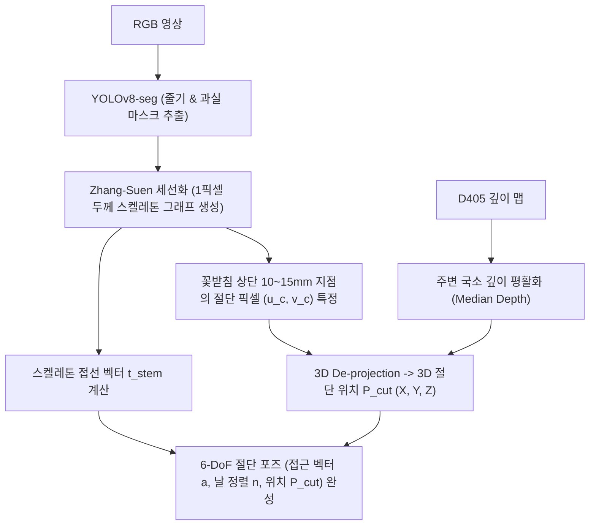
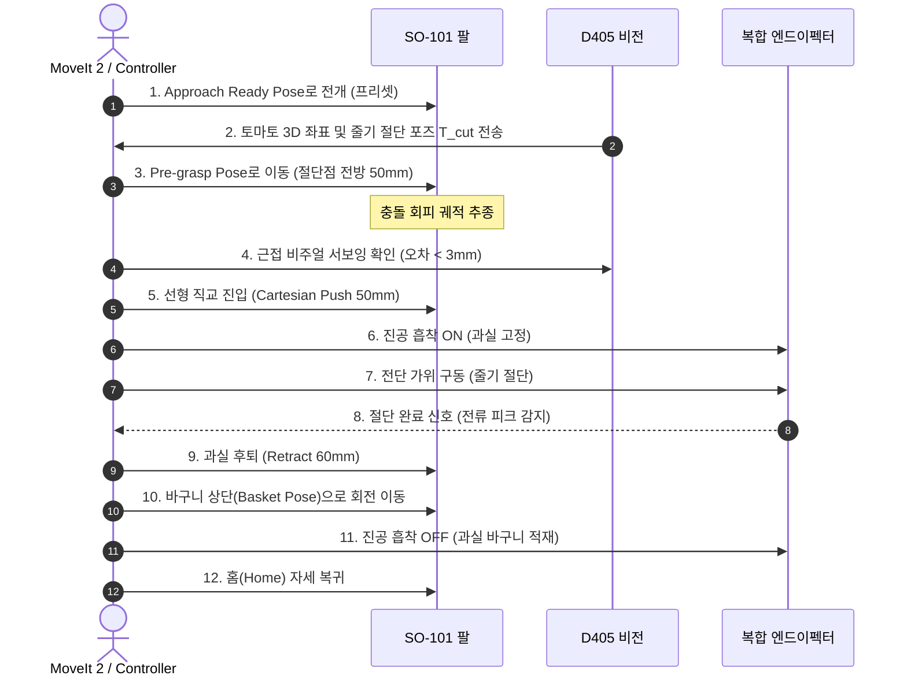

# 엔드이펙터 파지, 줄기 절단 기구학 및 모션 플래닝
> **End-Effector Design, Peduncle Cutting Kinematics, 6-DoF Pose Synthesis, and Collision-Free Motion Planning**

---

## 1. 수확 방식 비교: 과실 당김(Pulling) vs 줄기 절단(Stem Cutting)

토마토 수확 메커니즘을 설계할 때 가장 먼저 결정해야 하는 것은 **과실을 분리하는 물리적 방식**입니다.


| 비교 항목 | 직접 당김 (Pulling) | 줄기 절단 (Cutting) - **산업 표준** |
|---|---|---|
| **과실 손상률** | 높음 (15~30%, 과피 압착 및 과즙 분출) | **극히 낮음 (<2%)** |
| **줄기/꼭지 보존** | 꽃받침이 뜯겨나가거나 열매만 분리됨 | **꽃받침과 T자형 꼭지가 깔끔하게 보존** (상품성 극대화) |
| **필요 비전 정밀도** | 중간 (과실 3D 중심점만 알면 됨) | **높음 (1~3mm 직경의 줄기 중심선 특정 필요)** |
| **엔드이펙터 복잡도** | 단순 집게 | **그리퍼 + 커터 복합 기구 (Dual-action)** |

---

## 2. 3D 줄기(Peduncle) 절단점 및 6-DoF 파지 포즈 도출 알고리즘

얇은 줄기(직경 1~3mm)는 3D 포인트 클라우드에서 노이즈로 인해 점이 끊기기 쉽습니다. 따라서 **"2D 세그멘테이션 마스크에서 스켈레톤(골격)을 추출한 뒤, 깊이 맵과 역투영하여 3D 절단 벡터를 복원하는 2-Stage 하이브리드 파이프라인"**이 가장 신뢰성이 높습니다.



### 2.1 2D 스켈레톤 추출 및 세선화 (Zhang-Suen Thinning Algorithm)
줄기 2D 바이너리 마스크 $M(u, v) \in \{0, 1\}$에 대해 Zhang-Suen 반복 세선화를 적용하여 줄기의 중심 뼈대 픽셀 집합 $S = \{(u_k, v_k)\}$를 얻습니다.

스켈레톤 상에서 토마토 과실 마스크와 접하는 시작점 $(u_{calyx}, v_{calyx})$으로부터 줄기를 따라 유클리드 거리로 $12\text{mm}$에 해당하는 화소 거리 $L_{pixel} = 12 \cdot f_y / Z$ 만큼 떨어진 점을 **절단점 $(u_c, v_c)$**으로 선정합니다.

### 2.2 3D 절단 좌표계 및 회전 행렬 $R_{cutting}$ 도출
절단점 $(u_c, v_c)$에서 줄기의 진행 방향 접선 단위 벡터를 $\mathbf{t}_{stem}$이라 할 때, 엔드이펙터가 가져야 할 3차원 자세는 직교 기저(Orthonormal Basis)로 구성됩니다:

1. **줄기 축 벡터 ($\mathbf{z}_{cut}$)**:
   $$
   \mathbf{z}_{cut} = \mathbf{t}_{stem}
   $$
2. **접근 벡터 ($\mathbf{x}_{cut}$, 엔드이펙터 진입 방향)**:
   카메라의 시선 벡터 $\mathbf{v}_{cam}$과 줄기 축 $\mathbf{z}_{cut}$에 모두 수직인 방향으로 진입하여 다른 줄기와의 간섭을 최소화합니다:
   $$
   \mathbf{x}_{cut} = \frac{\mathbf{v}_{cam} \times \mathbf{z}_{cut}}{\| \mathbf{v}_{cam} \times \mathbf{z}_{cut} \|}
   $$
3. **가위 날 정렬 벡터 ($\mathbf{y}_{cut}$)**:
   $$
   \mathbf{y}_{cut} = \mathbf{z}_{cut} \times \mathbf{x}_{cut}
   $$

최종적인 6-DoF 절단 변환 행렬은 다음과 같습니다:

$$
^{camera}T_{cut} = \begin{bmatrix}
\mathbf{x}_{cut} & \mathbf{y}_{cut} & \mathbf{z}_{cut} & \mathbf{P}_{cut} \\
0 & 0 & 0 & 1
\end{bmatrix}
$$

---

## 3. 5자유도(5-DoF) 매니퓰레이터의 기구학적 특성과 한계 극복 (SO-101 특화)

일반적인 6자유도 산업용 로봇 팔과 달리, 우리 시스템의 SO-101(또는 LeRobot 계열 저비용 팔)은 **5축(5-DoF)** 구조를 가집니다:
- 관절 1: Base Yaw (회전)
- 관절 2: Shoulder Pitch (들어올림)
- 관절 3: Elbow Pitch (팔꿈치)
- 관절 4: Wrist Pitch (손목 상하)
- 관절 5: Wrist Roll (손목 회전)

```
        [관절 4: Wrist Pitch] ─── [관절 5: Wrist Roll] ─── [집게/커터]
                 │
        [관절 3: Elbow Pitch]
                 │
        [관절 2: Shoulder Pitch]
                 │
        [관절 1: Base Yaw]
                 │
           [Base Frame]
```

### 5-DoF의 핵심 기구학적 제약사항
1. **임의의 자세에서 제자리 Yaw 회전 불가**:
   손목에 독립적인 Yaw 축이 없으므로, 집게의 수평 방향 각도는 Base Yaw 관절에 완전히 종속됩니다.
   - **유일한 예외**: 집게가 바닥을 수직으로 내려다보는 자세($\text{Pitch} \approx -90^\circ$)일 때만, `Wrist Roll` 관절이 물리적으로 `Yaw` 회전 역할을 대신할 수 있습니다.
2. **특이점(Singularity) 회피**:
   팔을 수직으로 곧게 세웠을 때(`Lift=90, Elbow=0, Wrist=0`)는 기구학적 특이점이 발생하여 순간적으로 X, Y 방향 조그 이동이 차단됩니다.
   - **대책**: 작업을 시작할 때 반드시 작업 영역 전방으로 살짝 굽혀진 프리셋 자세(Approach Ready Pose)로 먼저 전개한 뒤 직교 좌표 이동(Cartesian Move)을 시작해야 합니다.
3. **하중 처짐(Sagging) 보상**:
   금속 고정밀 감속기가 아닌 플라스틱 3D 프린팅 링크와 마이크로 버스 서보를 사용하므로, 팔을 앞으로 길게 뻗을수록 중력에 의해 Z축으로 5~15mm 처짐이 발생합니다.
   - **대책**: 거리 $R = \sqrt{X^2 + Y^2}$에 비례하여 Z 목표 좌표를 오프셋 보상($Z_{target} = Z + k \cdot R^2$)하거나 실시간 비주얼 서보잉으로 닫힌 루프 제어합니다.

---

## 4. 엔드이펙터 하드웨어 복합 메커니즘 설계

로봇 팔의 페이로드(SO-101의 경우 최대 약 250~350g)를 초과하지 않으면서 안정적인 절단 수확을 달성하기 위한 추천 엔드이펙터 설계안입니다:

```
          [소형 진공 흡착 패드] (과실 중앙 흡착 고정)
                  ▲
                  │  (약 30mm 간격)
                  ▼
          [마이크로 전동 전단 가위] (줄기 순간 절단)
             ├── 고정 날 (Anvil)
             └── 회전/왕복 가동 날 (Blade, 서보/DC 모터 구동)
```

1. **파지/지지부**:
   - 미니 12V 진공 펌프와 실리콘 벨로우즈 흡착 컵(직경 20mm).
   - 과실 표면에 닿는 순간 진공 밸브를 열어 과실을 안정적으로 끌어당겨 고정.
2. **절단부**:
   - 흡착 컵 상단 30mm 위치에 소형 스테인리스 전단 날(Shear Blade) 배치.
   - 소형 서보 모터(또는 솔레노이드)로 0.3초 내에 가위를 닫아 줄기를 절단.
3. **절단 완료 센싱 (Feedback)**:
   - 가위 모터의 전류 센싱: 줄기를 자를 때 순간적으로 전류 피크(Spike)가 발생했다가 절단 완료 후 급감하는 프로파일을 감지하여 성공 여부 판별.

---

## 5. 무충돌 수확 모션 시퀀스 (Collision-Free Motion Sequence)



다음 문서인 [`05_PRACTICE_JETSON_ROS2.md`](05_PRACTICE_JETSON_ROS2.md)에서는 본 아키텍처를 현재 실제 로봇 하드웨어에 직접 빌드하고 실행하는 **실전 ROS 2 엔지니어링 코드**를 제공합니다.
