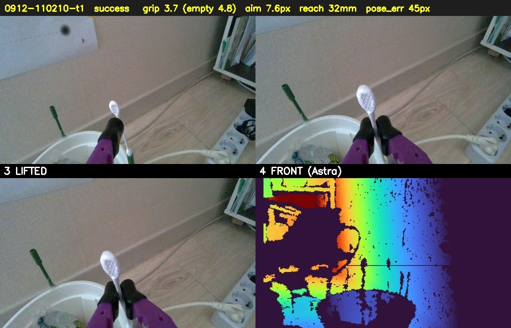
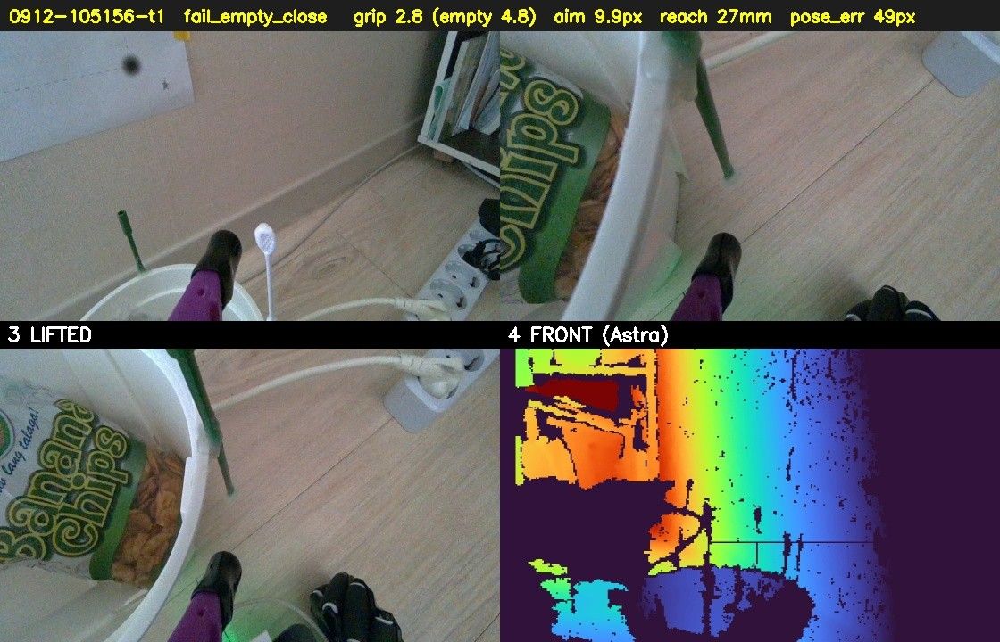
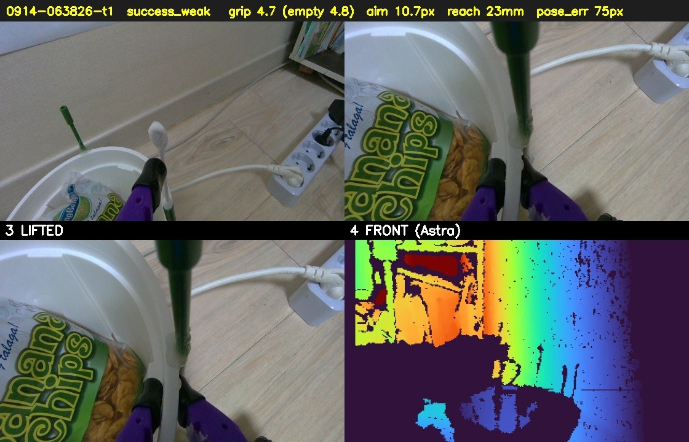
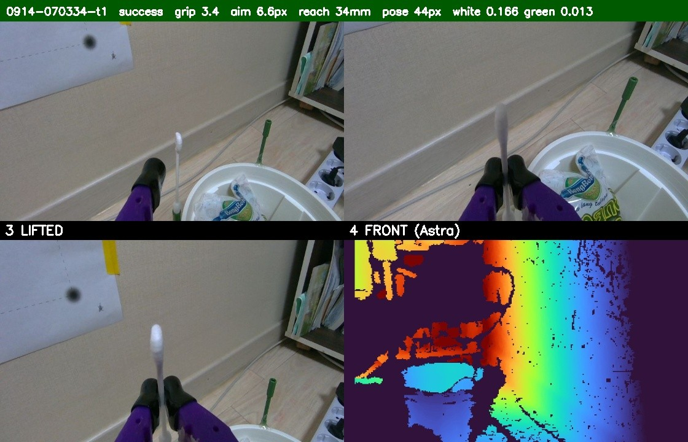

# 면봉 잡기 성공 보고서

사람이 **사진을 보고 직접 판단**하라고 만든 문서다. 숫자(집게가 선 자리)는 판정의 근거이지
증거가 아니다 — 실제로 2026-09-10 하루 사이 판정 기준이 세 번 바뀌었고, 그때마다 과거의
성공/실패가 뒤집혔다. 그래서 **사진을 같이 남긴다.**

판정 숫자의 뜻: 집게를 `--grip-shut 0` · 토크 상한 900으로 닫았을 때
**빈손이면 2.8**, **면봉 솜 머리를 물면 3.4~5.4**에 선다(문턱 3.3).

---

## 1. 2026-09-10 23:05 — 처음으로 "추정에 기대지 않고" 물었다
겨냥 7화소 · 22mm 나아가 물어보고 빈손 → 8mm 더 → **집게 4.0**.

**손목 카메라(들어 올린 뒤)** — 솜 머리가 두 턱 사이에 눌려 있고 자루가 아래로 늘어져 있다.

**전경(사용자 화면녹화의 웹캠 패널, 23:06:05)** — 팔이 들려 있는 것은 보이지만 이 각도로는
면봉이 안 보인다. **전경 카메라 각도가 판단에 못 쓸 자리에 있었다**는 뜻이다.

## 2. 2026-09-11 15:21 — 자세를 스스로 찾아 물었다
자동으로 고른 시작자세 `-30,10,120,68,0` · 겨냥 6화소 · 15mm+8mm → **집게 3.4**.

## 3. 2026-09-11 20:29 — 조작대 버튼만 눌러서
자동 자세 `30,10,120,56,0` · 겨냥 9화소 · 28mm + 8mm×3 → **집게 3.4**. 347초.

## 4. 2026-09-11 20:46 — 사용자가 직접 버튼을 눌러서
자동 자세 `15,10,120,68,0` · 겨냥 11화소 · 21mm → **집게 5.4**(오늘 중 가장 확실하게 물림).
⚠ 이 시도의 사진은 젯슨 `~/swab_trials/0911-204617-t1-*.jpg`에 있고 **아직 안 가져왔다**
(그때 이미 종료 중이었다). 다음 접속 때 가져와 여기 붙인다.

---

## 없는 것 — 그리고 다음부터 남길 것
| 항목 | 지금까지 | 다음부터 |
|---|---|---|
| 손목 카메라 | 시도마다 4장 남김 (`~/swab_trials/`) | 그대로 |
| **전경(Astra Pro)** | **없음** — 성공 시각에 안 찍었다 | **찍는다**(`astra_snap`) |
| 외부 웹캠 | 각도가 나빠 판단 불가 | 각도를 바꾸면 같이 남긴다 |
| 한 장짜리 보고서 | 없음 | **자동 생성**(`make_report`) |

**2026-09-12에 넣은 것**: `swab_trials.py`가 시도마다
`~/swab_trials/reports/<시각>.jpg` 한 장을 만든다 — **시작 / 닫은 뒤 / 들어 올림 / 전경(Astra)**
네 칸에 판정·집게값·겨냥오차·뻗은 거리를 머리말로 얹는다. `reports/index.md`에도 한 줄씩 쌓인다.
사람이 그 한 장만 보면 잡았는지 아닌지 스스로 판단할 수 있다.

⚠ Astra는 컬러가 없을 때가 있어 그때는 **깊이를 색으로 칠해** 남긴다. 좌표 계산에는 절대
쓰지 않는다(정렬 안 됨 — CLAUDE.md 경고). 하한이 600mm라 팔 전체와 화분이 한 화면에 들어온다.

---

## 5. 2026-09-12 11:02 — **자동 보고서 첫 정식 기록**
자동으로 고른 자세 `30,10,120,56,0`(자세오차 45화소) · 겨냥 7.6화소 · 32mm 뻗고
물어보기 3회째에 **집게 3.7**. 네 칸이 한 장에 들어 있어 사람이 바로 판단할 수 있다 —
시작에 서 있던 면봉이, 닫은 뒤 집게에 물려 있고, 들어 올린 칸에서 화분 밖으로 들려 있다.

## 6. 같은 날 10:51 — 보고서가 **실패를 실패로** 보여 준 예
같은 자세 계열인데 겨냥하는 동안 표적 거리가 111 → 172mm로 흘러 배경을 쫓았고,
다섯 번 물어봐도 빈손(2.8)이었다. 시작 칸에는 면봉이 서 있는데 들어 올린 칸에는 없다 —
**"닫았다"가 아니라 "무엇을 들었나"로 판단**할 수 있다.

그 뒤 `--aim-band`(기본 40mm)를 넣었다: 겨냥 중 표적 거리가 처음 값에서 그만큼 벗어나면
다른 것을 쫓는 것으로 보고 다시 찾는다. 한 걸음의 변화는 매번 문턱보다 작아서
**누적을 봐야** 잡힌다.

---

## 7. 2026-09-14 06:38 — 거짓 성공: **초록 지지대를 물었다**
집게 4.7(빈손보다 벌어짐)로 "성공"이 찍혔지만 사진을 보면 **면봉 옆의 초록 지지대**를 물고 있다.
집게값은 **무엇을** 물었는지 말해 주지 않는다.

→ 고친 것 두 가지:
1. **표적에서 초록을 뺀다.** 단 **번지게 지우지 않는다** — 면봉이 지지대 안에 꽂혀 있어
   넓게 지우면 면봉 아랫부분까지 깎여 표적이 쪼그라들고 놓친다(06:52에 실제로 그랬다).
2. **물린 것의 색을 본다**(`held_color`). 무는 자리 **위쪽** 150화소 창의 흰색·초록 비율.
   사진으로 진위를 확인한 9건으로 규칙을 맞췄다:

| 판정 | 조건 | 확인된 9건 결과 |
|---|---|---|
| 지지대를 문 실패 | 흰색 < 2% 이고 초록 > 10% | 가짜 1건을 정확히 걸러 냄 |
| 성공 · **사진 확인** | 흰색 < 5% | 진짜 1건 · 가짜 1건(화분) — 사람에게 넘김 |
| 성공 | 그 밖 | 진짜 6건 |

   ⚠ **진짜 성공은 하나도 버리지 않도록** 맞췄다. 어떤 창도 진짜와 가짜를 완벽히 가르지
   못했기 때문에(조명에 따라 솜이 회색·분홍으로 보인다), 확실한 경우만 자동으로 뒤집고
   애매하면 **보고서 머리말을 주황색으로 칠해 "CHECK PHOTO"**를 붙인다. 확실한 성공은 초록색.

## 8. 2026-09-14 07:03 — 확실한 성공(초록 머리말)
자동 자세(44화소) · 겨냥 6.6화소 · 34mm · 물어보기 3회째 **집게 3.4** · 흰색 16.6% / 초록 1.3%.
들어 올린 칸에서 솜 머리가 위로 선 채 화분에서 떨어져 있다.

