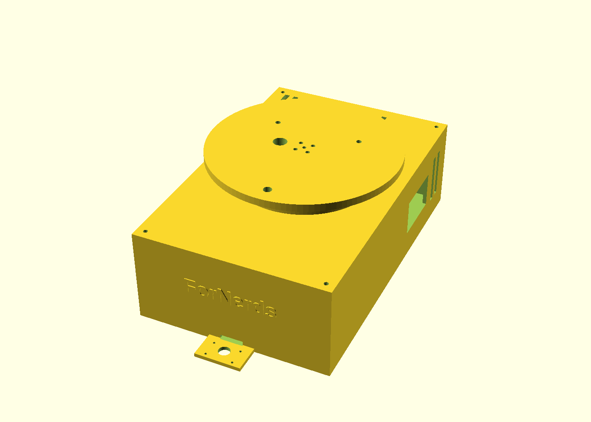

# 케이스 (트레이 + 뚜껑 + 180° 회전판)

원본 = [`tomato_case.scad`](tomato_case.scad) (OpenSCAD 2021.01에서 컴파일 확인).
치수 출처 = [`docs/design/3D-parts-mapping.md`](../../docs/design/3D-parts-mapping.md).



## 구조
| 부품 | 들어가는 것 |
|---|---|
| `tray` | 151.9 × 236.6 × 70. **앞=아두이노**(+바닥 카메라 선반), 그 뒤 **배터리(세움)**, 가운데 뚜껑 밑 서보, **뒤=젯슨**(밑에 벅부스트 2장, 오른쪽 벽에 전압·전류계 창, 단자는 뒷벽). 바닥이 차체 상판의 **M3 50×30 패턴 두 벌(중심 간격 166)**에 그대로 박힌다. 전면 "ForNerds" 양각 |
| `lid` | 6816 바깥 링 받침(턱+벽), 밑에 STS3215 서보 걸이, 180° 배선 슬롯, 스토퍼 홈 |
| `clamp` | 6816 바깥 링 누름 링 (M3×4) |
| `platform` | SO-101 베이스 인서트 구멍, Orbbec 1/4" 나사 자리, 혼 연결 기둥(15.7), 안쪽 링 턱 + 스냅 허브, 스토퍼 핀 |
| `fit_test` | 베어링 끼움 공차 시험 링 6개 — **이것부터 뽑는다** |

## 설계 판단 (바꾸기 전에 읽을 것)
- **팔 무게는 베어링(레이지수잔, 구매품)이 받는다.** 팔을 뻗으면 서보 축에 굽힘 모멘트가
  걸려 축·기어가 먼저 망가진다. 서보는 돌리기만 한다.
- **배선은 중심을 못 지난다** — 서보 축이 중심에 있다. 뚜껑의 180° 호형 슬롯을 따라
  회전판의 구멍이 함께 돈다. 슬롯은 서보 몸체 반대편(−X).
- **180°는 스토퍼 핀+홈으로 기계적으로 막는다** — 소프트 리밋만 믿으면 오지령 한 번에 배선이 끊긴다.

- **배터리는 세워서 아두이노 바로 뒤에 가로로 눕힌다** — 크기 = BOTTOM 관통 터널 43×57×134(사용자 확인).
  눕히면(높이 43) 뚜껑 밑 서보 걸이와 부딪혀서 세운다. 앞뒤 턱 + 바닥 밴드 슬롯 4개로 고정.
  순서(앞→뒤): 아두이노 → 배터리 → 서보(회전 중심) → 젯슨. 배선 슬롯은 배터리와 젯슨 사이 왼쪽 빈칸에 떨어진다.
- **벅부스트 2장(76.6×45)은 젯슨 밑에 앞뒤로** — 45+45=90 ≤ 젯슨 깊이 90.5. 케이스를 안 키우는 유일한 자리.
  젯슨 받침 높이는 `buck_parts_h`(판 위 가장 높은 부품)에서 계산된다 — 이 값을 재야 한다(지금 20).
  젯슨 NVMe 슬롯이 밑면이라 SSD를 갈 땐 젯슨을 들어내야 한다.

## 회전 베어링 = 6816-2RS (80 × 100 × 10, 얇은 깊은홈) — 2026-09-26 구매
레이지수잔은 기울기 유격이 커서 뺐다(팔 끝 30cm에서 0.5°면 ~2.6mm). 5.5인치 제품은 안지름 64라 안쪽에 들어갈 자리도 없었다.

**두 링을 위아래 모두 붙잡는다** — 끼움만으로는 팔을 뻗을 때 한쪽이 들린다(0.9kg×20cm ÷ Ø90 ≈ 양쪽 20N).
| 링 | 아래 | 위 |
|---|---|---|
| 바깥 링 | 뚜껑 받침 턱(높이 3) | 누름 링 `clamp` (두께 2, M3 셀프탭 4개 — 회전판 올리기 **전에** 조인다) |
| 안쪽 링 | 허브 끝 **스냅 걸쇠**(0.5 턱, 세로 홈 6개로 휜다 — 밀어 넣으면 딸깍) | 회전판 턱(높이 3) |

- 뚜껑 윗면 → 회전판 밑면 = 16. 혼 연결 기둥 15.7 → **혼 나사 M3×25**.
- 안쪽 배치(반지름): 혼 구멍 11.5 · 배선 슬롯 14~26 · 스토퍼 홈 29~35 · 허브 벽 37~40. 살은 모두 2.5mm 이상.
- **조립 순서**: ① 서보를 뚜껑 밑 걸이에 ② 베어링을 받침에 눌러 넣고 누름 링 조임 ③ 혼을 서보에 ④ 회전판 허브를 안쪽 링에 밀어 넣어 걸쇠를 채움 — 이때 스토퍼 핀이 홈에 들어가게, 서보는 중앙(2048) ⑤ 혼 나사 4개를 위에서.
- **끼움 공차는 프린터마다 다르다** → `part="fit_test"`(받침 +0.0/+0.2/+0.4, 허브 −0.2/−0.1/0.0, 돌기 수 = 순번)를 먼저 뽑아
  베어링을 끼워 보고, 손으로 꽉 눌러 들어가는 것을 `brg_fit_od`·`brg_fit_id`에 넣는다.
- SO-101 볼트 구멍(반지름 42)이 베어링 바로 위다 → 회전판에 **M3 열압입 인서트**를 박고, 나사는 판(6)을 넘지 않는 길이로.

## 회전 서보 = STS3215 C018 (12V · 1/345 · 30kg·cm) — 팔과 같은 것 (2026-09-26 구매)
외형도([제조사](https://www.feetechrc.com/525603.html)): 몸체 45.23×24.73×35 · 출력축은 몸체 중심에서 12.5(가까운 끝에서 10.1) ·
25T 스플라인(외경 5.9, 윗면 위 3.4) · 원판 혼 Ø19.95, **M3 4개 / 볼트원 14**, 가운데 M3 고정 나사.
| 따져 본 것 | 값 | 판단 |
|---|---|---|
| 무게 | 베어링이 받는다 | 서보는 돌리기만 |
| 가속 토크 | 팔 ~0.9kg·무게중심 15cm → 관성 ~0.025kg·m², 0.2초에 가속하면 ~6kg·cm | 30kg·cm로 5배 여유 |
| 되받는 토크 | 팔의 어깨(pan) 서보가 휘두를 때 반작용이 회전판에 온다 — 최대 그 서보의 스톨 30kg·cm | **같은 서보라야 비긴다** (더 약하면 판이 밀린다) |
| 백래시 | 실측 ~0.87° (스펙 ≤0.5°) → 팔 끝 30cm에서 **~4.6mm** | 손-눈 15mm 예산 안. 출력축 자기 엔코더라 **읽은 각은 진짜 각** — TF는 읽은 값으로 |
| 분해능 | 0.088°/틱 → 30cm에서 0.46mm | 충분 |
| 배선·전원 | 팔 버스에 **ID 7**로 한 줄 더, 팔 12V 레일 공유 | 새 드라이버·새 전원 없음. 12V 벅부스트 용량을 7개 기준(스톨 2.7A)으로 확인 |

- 감속기(프린트 기어)는 넣지 않는다 — 기어 유격이 서보 백래시에 더해진다. 판이 밀리는 게 실측되면 그때 3:1.
- ⚠ **0/4095 경계를 180° 구간 밖에 두라** — wrist_roll에서 엔코더 경계가 가동구간에 걸려 팔이 튀었다
  (메모리 wrist-roll-wrap-fix). 조립 전에 중앙(2048)을 회전판 정면에 맞춰 영점을 쓴다.
- 출처: [RobotShop STS3215 12V 30kg](https://www.robotshop.com/products/feetech-12v-30kgcm-magnetic-encoding-servo-sts3215) ·
  [Robo9 백래시·반복정밀도 실측](https://robonine.com/testing-of-feetech-sts3215-servomotor-backlash-repeatability-and-torque/)
- **바닥 카메라를 앞으로 옮기면**: 젯슨 CSI 단자(뒤)까지 약 20cm라 기본 15cm 리본이 안 닿는다(30cm 필요).
  또 라인 주행의 앞뒤·부호가 지금 카메라 위치에 묶여 있으니 옮긴 뒤 `/settings`에서 축 부호·영점을 다시 잡는다.

## 뽑기
```
openscad -D 'part="tray"'     -o tray.stl     tomato_case.scad
openscad -D 'part="lid"'      -o lid.stl      tomato_case.scad
openscad -D 'part="clamp"'    -o clamp.stl    tomato_case.scad
openscad -D 'part="platform"' -o platform.stl tomato_case.scad
openscad -D 'part="fit_test"' -o fit_test.stl tomato_case.scad
```
- `lid`는 뒤집어서(서보 걸이가 위로) 출력. `platform`도 뒤집어서(허브가 위로) — 허브 걸쇠 턱이 45° 비탈이라 받침 없이 된다.
- 콘솔에 `⚠`가 뜨면 베드 초과·부품 겹침이다.

## 출력 전 실측 (scad의 `[실측]` 줄)
베어링 끼움 공차(`fit_test`) · 벅부스트 부품 높이 · 젯슨 캐리어 고정 구멍 위치(지금 86×58 추정) ·
SO-101 나머지 두 구멍과 앞뒤 위치. 목록 = [`3D-parts-mapping.md`](../../docs/design/3D-parts-mapping.md) 끝.
